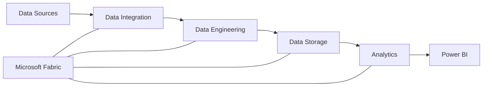
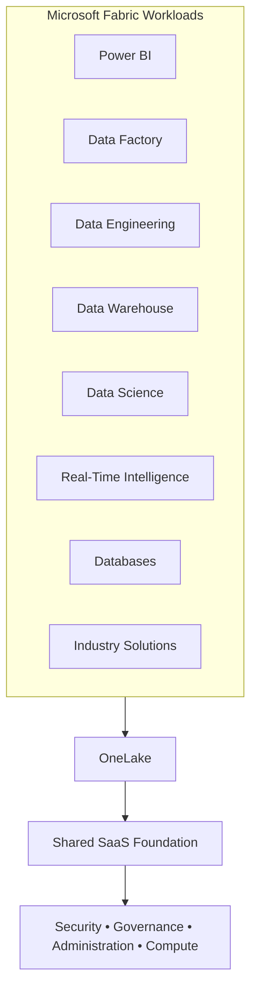
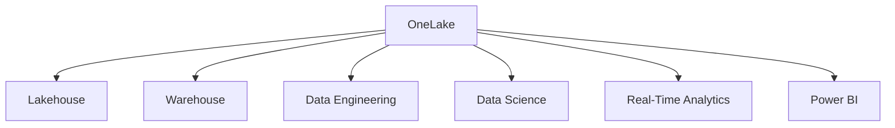
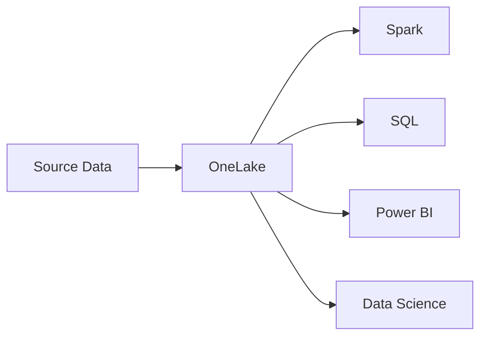

# Microsoft Fabric Overview

## What is Microsoft Fabric?

Microsoft Fabric is an **end-to-end SaaS data and analytics platform** that brings data integration, data engineering, data warehousing, data science, real-time analytics, databases, and business intelligence together in a single environment.

Traditionally, organizations may need to combine multiple services to ingest data, store it, transform it, analyze it, secure it, and finally present it through reports.

Fabric brings these capabilities together as an integrated platform.

The important concept for me is that **Fabric is not simply another analytics tool**. It is a platform containing multiple analytics workloads that share common storage, security, governance, administration, and compute capabilities.

---

## Fabric as a SaaS Platform

Microsoft Fabric is built on a **Software as a Service (SaaS)** foundation.

This means Microsoft manages much of the underlying infrastructure required to operate the platform.

Instead of spending as much time integrating and managing separate infrastructure components, teams can focus more on:

- Data ingestion
- Data transformation
- Data modeling
- Analytics
- Reporting
- Security
- Governance
- Business solutions

Fabric brings together capabilities from technologies such as **Power BI, Azure Synapse Analytics, and Azure Data Explorer** into an integrated SaaS experience.

### Why This Matters

A SaaS-based architecture provides a more unified experience for both administrators and developers.

From an enterprise perspective, some of the major benefits include:

- Centralized administration
- Integrated security and governance
- Shared data foundation
- Consistent user experience
- Reuse of data across workloads
- Less infrastructure management
- Reduced need to integrate separate analytics platforms

---

## Fabric Architecture at a High Level

Fabric can be viewed as multiple workloads operating on top of a shared platform and data foundation.

Rather than every workload creating its own completely separate data platform, Fabric provides shared capabilities that allow the workloads to work together.

---

# Microsoft Fabric Workloads

Fabric is not a single tool.

It contains different **workloads**, with each workload designed for a particular type of data or analytics work.

## Power BI

**Power BI** is the business intelligence and analytics workload.

It is used for:

- Semantic models
- Reports
- Dashboards
- Data visualization
- Business analytics
- DAX

Power BI allows business users and analysts to explore data and turn it into business insights.

---

## Data Factory

**Data Factory** provides data integration and orchestration capabilities.

It can be used for:

- Data ingestion
- Data movement
- Pipelines
- Workflow orchestration
- Dataflows Gen2
- Data transformation

Pipelines are commonly used to orchestrate data movement and processing, while Dataflows Gen2 provide low-code data transformation capabilities based on Power Query.

---

## Data Engineering

The **Data Engineering** workload is designed for large-scale data processing and transformation.

It is built around technologies such as Apache Spark and supports:

- Lakehouses
- Notebooks
- Spark
- Spark jobs
- Data preparation
- Data transformation

This workload is particularly useful when engineers need to process and prepare large volumes of data for downstream analytics.

---

## Data Warehouse

The **Data Warehouse** workload provides a SQL-based analytical experience for structured and relational data.

It is designed for users and teams familiar with SQL and traditional data warehousing concepts.

Common scenarios include:

- Enterprise data warehouses
- Dimensional models
- Structured analytical data
- T-SQL development
- SQL-based transformations
- Business reporting

---

## Data Science

The **Data Science** workload supports machine learning and predictive analytics.

It provides capabilities such as:

- Notebooks
- Experiments
- Machine learning models
- Model training
- Predictive analytics

This allows data scientists to develop machine learning solutions while working within the same Fabric data platform.

---

## Real-Time Intelligence

**Real-Time Intelligence** is designed for streaming, event-driven, and time-sensitive data.

Typical examples include:

- Application logs
- Telemetry
- IoT events
- Time-series data
- Streaming data

It supports technologies such as KQL for analyzing large volumes of event and time-series data with low latency.

---

## Databases

Fabric also provides database capabilities for operational and transactional workloads.

The database experience brings operational data closer to the Fabric analytics ecosystem, allowing data to be used by downstream analytics workloads with less integration complexity.

---

## Industry Solutions

**Industry Solutions** provide capabilities designed around specific industries and business scenarios.

These solutions can include prebuilt data models, integrations, and analytics experiences that help organizations accelerate implementation instead of designing every component from the beginning.

---

# OneLake: The Data Foundation

One of the most important parts of the Fabric architecture is **OneLake**.

OneLake is the unified logical data lake for Microsoft Fabric.

A useful way to think about it is:

> **OneLake is like OneDrive for organizational data.**

Instead of individual Fabric workloads maintaining completely separate storage environments, OneLake provides a common data foundation that Fabric workloads can use.

OneLake is built on **Azure Data Lake Storage (ADLS)** technology and supports open data formats.

Fabric commonly uses **Delta Lake / Parquet** for analytical data, which allows multiple Fabric compute engines to work with the same underlying data.

---

## One Copy of Data, Multiple Experiences

A major architectural goal of Fabric is to reduce unnecessary data movement and duplication.

Different Fabric workloads can work with data through the shared OneLake foundation.

This creates an architecture where data can be ingested and stored once and then used by different analytics experiences.

For example:

Instead of creating a separate copy of the data for every analytics technology, the goal is to allow different engines to work with a common data foundation whenever the architecture supports it.

OneLake **shortcuts** can also provide access to data stored in other locations without requiring the data to be physically copied into OneLake.

Detailed OneLake architecture will be covered under:

**[02 — Data Architecture](../02-Data-Architecture/)**

---

# Why Fabric is Different

The biggest difference I see with Fabric is not simply that Microsoft added more analytics services.

The architectural difference is the **integration of those services**.

Fabric provides:

| Traditional Approach | Microsoft Fabric Approach |
|---|---|
| Multiple analytics services | Integrated analytics workloads |
| Separate storage architectures | Shared OneLake foundation |
| More service-to-service integration | Pre-integrated Fabric experiences |
| Separate administration across services | More centralized platform administration |
| Data frequently copied between systems | Greater ability to reuse data |
| Different development experiences | More consistent Fabric experience |

This does not mean every traditional Azure data service is replaced by Fabric.

The architecture decision still depends on the organization's requirements, existing platforms, networking, security, workload characteristics, and integration needs.

---

# My Understanding

I think of Microsoft Fabric as an **integrated analytics platform rather than a collection of individual tools**.

The workloads serve different purposes:

**Data Factory**  
→ Move and orchestrate data

**Data Engineering**  
→ Process and transform large-scale data

**Data Warehouse**  
→ Provide structured SQL analytics

**Data Science**  
→ Build machine learning solutions

**Real-Time Intelligence**  
→ Analyze streaming and event data

**Power BI**  
→ Model, visualize, and analyze business data

**OneLake**  
→ Provide the common data foundation

The important architecture concept is that these workloads do not operate as completely isolated services. They are designed to work together through a shared SaaS platform, common data foundation, and integrated security, governance, and administration.

That shared foundation is what makes Microsoft Fabric different from simply deploying several independent analytics technologies.
