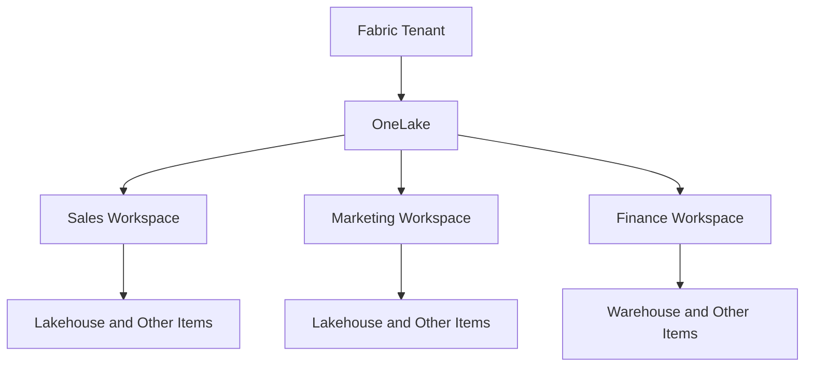
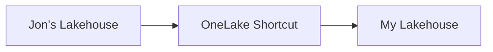
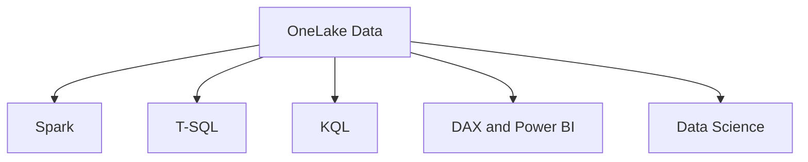
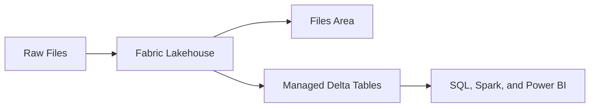

# OneLake and Lakehouse Overview

## 1. What Is OneLake?

OneLake is the centralized, logical data lake for Microsoft Fabric. It is a core part of Fabric’s data-centric architecture and provides a single, integrated environment where data professionals and business users can collaborate on data projects.

A helpful way to remember OneLake is:

> **OneLake is OneDrive for organizational data.**

OneLake is a Software as a Service (SaaS) capability. Microsoft automatically provisions it with the Fabric tenant, so an organization does not need to create or manage a separate storage account before using Fabric.

### One OneLake per Tenant

There is one logical OneLake for each Microsoft Fabric tenant.

- A single-tenant organization has one logical OneLake.
- An organization operating multiple tenants has a separate OneLake for each tenant.
- OneLake creates a unified storage namespace within the tenant.

Even when different teams ingest data from different systems and use different Fabric workloads, their Fabric data is stored behind the scenes in OneLake.

---

## 2. What Is a Data Lake?

A data lake is a centralized, general-purpose repository that can store large volumes of data in its original or processed form.

It can store:

- Structured data, such as tables with rows and columns
- Semi-structured data, such as JSON and XML
- Unstructured data, such as documents, images, audio, and video
- File formats such as CSV, JSON, Parquet, and Delta

A traditional data lake is commonly organized through:

- Storage containers
- Directories
- Subdirectories
- Files

A data lake is an enterprise data-storage solution that provides flexibility for storing many types of data.

However, flexibility alone does not guarantee that the data is usable, secure, governed, organized, or easy to discover.

---

## 3. OneLake Organizational Structure

Within Microsoft Fabric, a workspace is the first major container created by a team.

A workspace stores and manages Fabric items, including:

- Lakehouses
- Warehouses
- Notebooks
- Pipelines
- Semantic models
- Reports
- Eventhouses
- KQL databases

The logical organization can be understood as:

> **Tenant → Domain → Workspace → Fabric item → Data**

### Tenant

The tenant is the top organizational boundary. One logical OneLake is automatically provisioned for each Fabric tenant.

### Domain

A domain logically groups workspaces that belong to the same business area, such as:

- Sales
- Marketing
- Finance
- Human Resources
- Operations

Domains support data-mesh-style organization and delegated governance. Domain administrators can manage certain settings for their business areas.

> A domain helps organize and govern workspaces, but placing workspaces in the same domain does not automatically grant users access to their data.

### Workspace

A workspace is a collaborative container for Fabric items.

Different workspaces allow teams and business units to work independently while contributing data to the same logical OneLake.

Workspaces can have different:

- Administrators
- Users and roles
- Capacities
- Geographic regions
- Business purposes

### Fabric Items

Fabric items are the individual objects created inside a workspace.

Data-producing Fabric items automatically store their data in OneLake.

---

## 4. OneLake Across Regions

OneLake provides a single logical data lake that can span multiple geographic regions.

Workspaces may reside in different regions to support data-residency and organizational requirements while remaining part of the same logical OneLake namespace.

The physical storage is abstracted from users. Microsoft provisions the underlying storage resources required by each workspace.

The important distinction is:

> **OneLake is logically unified, even when the underlying workspace data is physically stored in different regions.**

This allows an organization to maintain a unified data environment without manually managing a separate storage account for every region or workspace.

---

## 5. OneLake Shortcuts

A shortcut provides a virtual reference to data stored in another location.

It makes the data appear inside a lakehouse without physically copying or moving it.

Shortcuts can reference data located in:

- Another Fabric workspace
- Another Fabric lakehouse
- Another location in OneLake
- Azure storage
- Amazon Web Services storage
- Other supported external data sources

### Example Scenario

Jon owns a lakehouse in another workspace. I need to use some of Jon’s data from my own lakehouse.

The process is:

1. Jon or the appropriate administrator grants me the required access.
2. I create a shortcut in my lakehouse that points to Jon’s data.
3. The data appears in my lakehouse as though it were physically stored there.
4. The physical data remains in Jon’s lakehouse.
5. Jon continues to own and manage the original data.
6. When Jon’s source data changes, I see the current data through the shortcut.

Shortcuts provide access:

- Without duplicating the data
- Without copying the data
- Without moving the data
- Without changing ownership of the source data

The data appears locally, but it remains in the original source location.

Access still depends on the applicable:

- Workspace permissions
- Item permissions
- OneLake permissions
- Shortcut configuration
- Source-system permissions
- Configured credentials

---

## 6. One Copy for Multiple Compute Engines

Different data professionals use different technologies based on their roles, skills, and experience.

| Role or experience | Common technology |
|---|---|
| Data engineer | Spark, Python, or SQL |
| SQL developer | T-SQL |
| Real-time analyst | KQL |
| Power BI developer | DAX and semantic models |
| Data scientist | Python, Spark, and machine-learning tools |

OneLake separates storage from compute.

Data stored once can be accessed by multiple compatible Fabric engines without creating a separate copy for every workload.

This allows teams to:

- Store data once
- Avoid unnecessary data duplication
- Select the correct compute engine for each task
- Collaborate on a shared data foundation
- Use tools that match their existing skills

The main concept is:

> **One copy of the data can support multiple compute experiences.**

---

## 7. Parquet and Delta Lake

OneLake can store many file types, including:

- CSV
- JSON
- Parquet
- Delta

Fabric’s primary table format is Delta Lake.

It is commonly described as **Delta-Parquet** because Delta tables store their data in Parquet files and add a transaction log.

### Limitations of CSV

CSV is simple and widely supported, but it has several limitations:

- It does not strongly preserve data types.
- It does not contain rich table metadata.
- It is not optimized for large analytical workloads.
- It does not provide transactions.
- It does not provide table-version history.
- It may require additional processing before analysis.

### Benefits of Parquet

Parquet is an open, columnar file format designed for analytical workloads.

It provides:

- Column-based storage
- Schema information
- Data-type information
- Compression
- Efficient analytical reads
- Better performance when queries require only selected columns

For example, if a table contains 100 columns but a query needs only five columns, a columnar format can read the required columns instead of scanning every column.

### Small-File Problem

Parquet performance can still suffer when a dataset contains too many small files.

Reading one appropriately sized Parquet file may be fast, but reading hundreds or thousands of small Parquet files creates additional processing overhead.

This is commonly called the **small-file problem**.

### What Delta Lake Adds

Delta Lake is an open-source table and storage layer built on top of Parquet.

It adds:

- A transaction log
- ACID transactions
- Schema management
- Table versioning
- Time travel
- Reliable updates
- Reliable deletes
- Better management of Parquet-based tables

### ACID Transactions

| Principle | Meaning |
|---|---|
| Atomicity | A transaction completes entirely or not at all |
| Consistency | Transactions preserve valid data rules and states |
| Isolation | Concurrent transactions do not corrupt one another |
| Durability | Committed changes remain saved |

### Time Travel

Time travel allows users to query or restore earlier versions of a Delta table while the required table history remains available.

The easiest way to remember the relationship is:

> **Parquet stores the data efficiently. Delta Lake adds transaction and table-management capabilities.**

Current OneLake capabilities also support Apache Iceberg interoperability, but Delta Lake remains central to the Fabric Lakehouse experience.

---

## 8. Storage and Compute Costs

OneLake storage and Fabric compute capacity are related but separate cost considerations.

### OneLake Storage

Storage charges begin when data is stored in OneLake.

Storage charges continue while the data remains stored, regardless of whether the Fabric capacity is actively running.

### Fabric Compute

Fabric capacity provides the compute resources used when Fabric workloads perform operations such as:

- Running notebooks
- Executing pipelines
- Processing Spark jobs
- Running warehouse queries
- Refreshing semantic models
- Processing real-time workloads

Eligible Fabric capacities can be paused to reduce compute charges when they are not needed.

Pausing the capacity does not remove data stored in OneLake. Therefore, OneLake storage charges can continue while compute capacity is paused.

The main distinction is:

> **Storage is the persistent cost of keeping the data. Capacity is the compute cost of processing the data.**

---

## 9. Open Access to OneLake Data

OneLake supports open file formats and industry-standard Azure Data Lake Storage and Blob APIs.

This allows supported applications and services outside Fabric to access OneLake data, subject to authentication and authorization.

Benefits include:

- Reduced vendor lock-in
- Compatibility with existing tools
- Access through standard APIs and SDKs
- Easier integration with external data platforms
- Reuse of existing applications
- Reuse of existing data skills
- Access to Fabric data from supported external tools

OneLake is therefore not limited to Fabric user interfaces. Supported external applications can connect to the data by using standard interfaces.

---

# Lakehouse Overview

## 10. What Is a Lakehouse?

A lakehouse combines the flexibility of a data lake with the table-management and analytical capabilities traditionally associated with a data warehouse.

A Fabric Lakehouse helps data professionals:

- Access and organize files
- Store raw data
- Store semi-structured data
- Store structured data
- Process data with Spark
- Process data with notebooks
- Create table-oriented objects
- Create managed Delta tables
- Query lakehouse tables through SQL
- Make prepared data available for downstream analytics

A lakehouse is therefore more than a storage location.

It provides a managed experience for processing files and transforming them into reliable analytical tables.

### Files Area

The Files area is the unmanaged portion of the lakehouse.

It can act as a landing zone for raw data and can contain:

- CSV files
- JSON files
- Parquet files
- Folders
- Subfolders
- Other supported file types

Users can navigate through directories, preview files, and load supported files into tables.

### Tables Area

The Tables area provides a managed, user-friendly representation of Delta tables.

Users can:

- View available tables
- Preview table data
- Inspect table schemas
- Access the underlying files
- Query tables
- Load files into new tables
- Load files into existing tables

The Tables area helps transform files into structured, managed analytical objects.

---

## 11. What Is a Data Swamp?

A data lake can become a **data swamp** when large amounts of data are stored without sufficient organization, quality, metadata, security, ownership, or governance.

Common data-swamp problems include:

- Poor data quality
- Missing metadata
- Unclear metadata
- Weak security
- Inconsistent governance
- Unclear ownership
- Duplicate data
- Difficulty finding trusted data
- Scalability problems
- Performance problems
- Difficult querying
- Difficult integration

A lakehouse helps reduce these risks by providing more structure around files and tables.

However, technology alone does not prevent a data swamp.

Organizations still need:

- Clear data ownership
- Data-quality standards
- Metadata management
- Security controls
- Governance policies
- Data-lifecycle management
- Trusted or certified data products
- Naming and organizational standards

---

## 12. Data Lake vs. Lakehouse vs. Data Warehouse

| Area | Data Lake | Lakehouse | Data Warehouse |
|---|---|---|---|
| Primary purpose | Flexible storage for many data types | Combine lake storage with managed analytical tables | Structured and governed SQL analytics |
| Typical data | Structured, semi-structured, and unstructured | Files, structured data, and Delta tables | Primarily structured relational data |
| Organization | Files, folders, and directories | Files plus managed tables | Schemas, tables, views, and relational objects |
| Primary users | Data engineers and data scientists | Data engineers, data scientists, SQL users, and BI teams | SQL developers, warehouse developers, and BI teams |
| Common access | File APIs, Spark, and processing engines | Spark, notebooks, SQL analytics endpoint, and Power BI | T-SQL, BI tools, and reporting applications |
| Schema approach | Often schema-on-read | Supports files and governed table schemas | Strong schema-on-write orientation |
| Transactions | Not inherent for ordinary files | Delta tables provide ACID transactions | Built-in transactional table behavior |
| Best fit | Raw landing zones and flexible storage | Engineering, data science, and analytics on a shared foundation | Curated relational analytics and SQL-first development |

### Data Lake

A data lake provides flexible, general-purpose storage.

It is useful for:

- Raw data
- Large volumes of data
- Multiple data formats
- Data-engineering workloads
- Data-science workloads
- Landing zones

### Lakehouse

A lakehouse adds managed tables, transactions, and analytical experiences to data-lake storage.

It is useful for:

- Files and tables
- Spark processing
- Notebook development
- Delta tables
- Data engineering
- Data science
- SQL analytics
- Power BI reporting

### Data Warehouse

A data warehouse provides a structured, relational, SQL-first environment for analytical data.

It is useful for:

- Structured relational data
- Dimensional models
- Star schemas
- T-SQL development
- Curated analytical data
- Business reporting
- SQL-focused development teams

In Microsoft Fabric, both Lakehouse and Warehouse store analytical data in OneLake and use open table formats.

The best choice depends on:

- The type of data
- Workload requirements
- Development experience
- Team skills
- Querying requirements
- Data-management requirements
- Reporting requirements

---

## 13. My Understanding

I think of OneLake as the shared data-storage foundation of Microsoft Fabric.

- There is one logical OneLake per Fabric tenant.
- Microsoft provisions OneLake automatically as a SaaS service.
- Different teams can ingest data from different sources.
- Fabric stores the data behind the scenes in OneLake.
- Workspaces organize Fabric items and their data.
- Domains group related workspaces and support delegated governance.
- Workspaces and permissions control access to data.
- Shortcuts provide virtual access without copying or moving data.
- Source owners continue to own and manage shortcut data.
- Multiple compute engines can work with the same shared data.
- Parquet provides efficient columnar storage.
- Delta Lake adds ACID transactions, schema management, and time travel.
- Storage and compute costs are managed separately.
- A lakehouse combines data-lake flexibility with managed analytical tables.
- Governance is required to prevent a data lake from becoming a data swamp.

The overall concept is:

> **OneLake provides one logical data foundation, while Lakehouse and other Fabric items provide specialized ways to organize, process, govern, and analyze that data.**

---

## References

- [OneLake Overview](https://learn.microsoft.com/fabric/onelake/onelake-overview)
- [OneLake Shortcuts](https://learn.microsoft.com/fabric/onelake/onelake-shortcuts)
- [OneLake Data Access Control Model](https://learn.microsoft.com/fabric/onelake/security/data-access-control-model)
- [Lakehouse and Delta Lake Tables](https://learn.microsoft.com/fabric/data-engineering/lakehouse-and-delta-tables)
- [Choose Between Warehouse and Lakehouse](https://learn.microsoft.com/fabric/fundamentals/decision-guide-lakehouse-warehouse)
