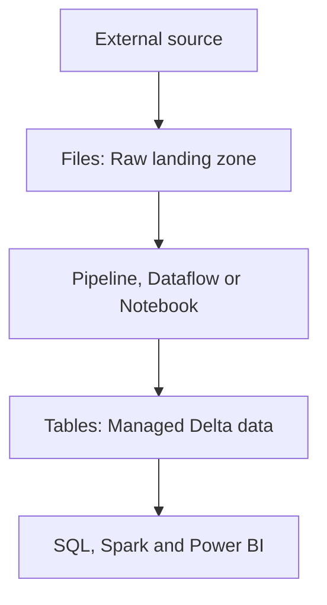
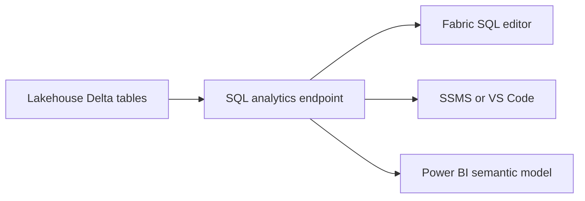
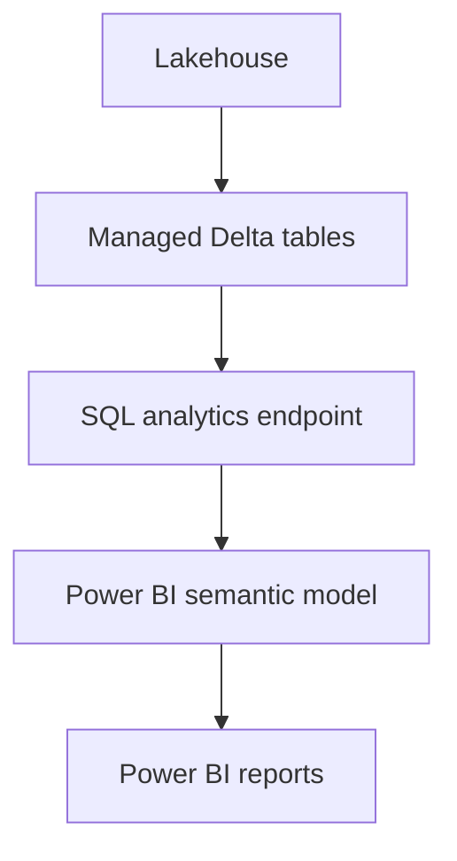

# Lakehouse Explorer and SQL Analytics

This study note covers the primary ways to store, explore, maintain, and query data in a Microsoft Fabric Lakehouse.

## Topics

- Lakehouse Files and Tables
- Managed and unmanaged storage
- Loading files into Delta tables
- Delta table maintenance
- OneLake File Explorer
- SQL analytics endpoint
- SQL and Visual Query editors
- Power BI semantic models

---

# Lakehouse Explorer

The Lakehouse Explorer is the central Fabric interface for working with a Lakehouse.

It allows users to:

- Browse tables, folders, and files
- Upload and preview data
- Create Delta tables
- Manage Lakehouse objects
- Access different analytical engines

A Lakehouse contains two primary storage areas:

| Area | Lakehouse section | Purpose |
|---|---|---|
| Managed | Tables | Stores structured Delta tables |
| Unmanaged | Files | Stores general-purpose files and folders |

---

# Lakehouse Files

## Files as an Unmanaged Area

The **Files** section works like a traditional data lake or file system.

It can store structured, semi-structured, and unstructured files, including:

- CSV
- Parquet
- JSON
- XML
- Excel
- Images
- Audio
- Video

Fabric stores these objects but does not automatically manage them as analytical tables.

Example:

```text
Files/
├── Raw/
│   ├── customers.csv
│   └── sales.parquet
├── Reference/
│   └── product-categories.xlsx
└── Archive/
    ├── 2025/
    └── 2026/
```

## Files as a Landing Zone

The Files area is commonly used as a landing or staging zone for raw data.



A typical process is:

1. Ingest raw data into the Files area.
2. Validate, clean, and transform the data.
3. Write the processed data to a Delta table.
4. Query the table with SQL, Spark, or Power BI.

Keeping the raw data can be useful for auditing, troubleshooting, and reprocessing.

## Working with Folders and Files

Lakehouse Explorer supports:

- Creating directories and subdirectories
- Uploading one or multiple files
- Renaming files and directories
- Deleting files and directories
- Retrieving a OneLake path from Properties
- Loading supported files into Delta tables

The left Explorer pane primarily shows folders. Selecting a folder displays its files in the main pane.

## File Preview

Preview support depends on the file format.

| Format | Typical behavior |
|---|---|
| CSV | Can usually be previewed |
| Excel | May not have a direct preview |
| Parquet | May not have a browser preview |
| Images, audio and video | Stored as files but not treated as tables |

A missing preview does not mean the file is invalid. Pipelines, notebooks, Dataflows, and other tools can still process it.

---

# Lakehouse Tables

## Tables as a Managed Area

The **Tables** section contains structured tables stored in Delta Lake format.

Fabric automatically discovers supported tables and displays them in Lakehouse Explorer.

A Delta table contains:

- Parquet data files
- Table metadata
- Transaction history
- A `_delta_log` directory

Example:

```text
Tables/
└── Sales/
    ├── part-00000.parquet
    ├── part-00001.parquet
    └── _delta_log/
        ├── 00000000000000000000.json
        └── 00000000000000000001.json
```

The Parquet files contain the data. The Delta log records table transactions and metadata.

This architecture supports capabilities such as:

- ACID transactions
- Schema enforcement
- Table history
- Time travel
- Updates and deletes through supported engines

## Loading Files into Delta Tables

Lakehouse Explorer provides a **Load to tables** option for converting supported files into Delta tables.

The simplified Lakehouse loading experience supports:

- CSV
- Parquet

Excel files cannot be loaded directly through this option. Use Dataflow Gen2, a pipeline, Power Query, or a notebook for Excel ingestion.

### Loading an Individual File

```text
Files/product.csv
        ↓
Load to tables
        ↓
Tables/Product
```

A file can also be dragged from Files into the Tables section.

### Loading a Folder

Fabric can traverse a folder and its subfolders and load compatible files into a table.

Files loaded together should have:

- The same format
- Compatible columns
- Compatible data types
- A consistent schema

Example:

```text
Files/Sales/
├── sales-january.parquet
├── sales-february.parquet
└── sales-march.parquet
```

These files can be loaded together if they have compatible schemas.

## New and Existing Tables

Data can be loaded into:

- A new table
- An existing table

When loading into an existing table, the available behaviors may include:

| Operation | Result |
|---|---|
| Append | Adds new rows to the existing data |
| Overwrite | Replaces the existing table data |

Overwrite should be used carefully because existing data may be replaced.

## CSV Loading

When loading a CSV file, Fabric may request:

- Whether the first row contains headers
- The delimiter or separator
- The destination table name

Fabric attempts to infer the schema from the CSV values.

For example:

```text
ProductID   → Integer
ProductName → Text
Price       → Decimal
```

Schema inference may not always produce the required data types. A date column, for example, might be interpreted as text.

When explicit schema control is required, use a notebook, pipeline, or Dataflow instead of the simplified loading interface.

## Why Parquet Is Better for Analytical Storage

Parquet stores column metadata and data types.

| CSV | Parquet |
|---|---|
| Text-based | Columnar binary format |
| Limited metadata | Metadata-rich |
| Data types must be inferred | Data types are stored |
| Generally larger | Highly compressed |
| Less efficient for analytical scanning | Optimized for analytics |

Because Parquet already contains schema information, it usually produces a cleaner result when converted into a Delta table.

---

# Unidentified Objects

The **Unidentified** area may appear when Fabric finds content in the managed Tables location that it cannot recognize as a valid Delta table.

Possible reasons include:

- A pipeline is still creating the table.
- Lakehouse Explorer has not refreshed.
- An unsupported file was written to the Tables location.
- The Delta-table structure is incomplete.
- The `_delta_log` directory is missing or invalid.

Possible actions include:

- Refresh Lakehouse Explorer.
- Wait for the pipeline or Dataflow to finish.
- Move ordinary files to the Files area.
- Delete content created accidentally.
- Troubleshoot the ingestion process.

---

# Delta Table Maintenance

Delta tables can accumulate many small Parquet files and obsolete historical files.

Fabric provides table-maintenance operations to improve storage and query performance.

## OPTIMIZE

OPTIMIZE combines smaller Parquet files into larger files.

This can:

- Reduce file-management overhead
- Improve data scanning
- Improve SQL and Spark query performance

Maintenance is especially helpful after large ingestion or update operations.

## V-Order

V-Order reorganizes Parquet data to improve read performance across Fabric engines.

It can be used with OPTIMIZE when appropriate for the workload.

## VACUUM

VACUUM removes obsolete data files that are older than the selected retention period.

```text
Retain required table history
            ↓
Remove obsolete files outside retention
            ↓
Reduce unnecessary storage
```

VACUUM must be used carefully. After an old file is removed, time-travel operations that depend on that file may no longer work.

## Running Maintenance

Maintenance can be performed through:

- Lakehouse Explorer
- Notebooks
- Data pipelines
- Fabric REST APIs

The portal experience is useful for ad hoc table maintenance. Notebooks and pipelines are more suitable for scheduled maintenance across multiple tables.

---

# OneLake File Explorer

OneLake File Explorer integrates OneLake with Windows File Explorer.

It provides a OneDrive-like experience for Fabric data.

After installation and authentication, users can browse Fabric-enabled workspaces and supported OneLake items.

Example:

```text
OneLake - Microsoft/
└── Finance Workspace/
    └── FinanceLakehouse.Lakehouse/
        ├── Files/
        └── Tables/
```

## Capabilities

Subject to permissions, users can:

- Browse accessible workspaces
- Navigate Lakehouse Files and Tables
- Upload files
- Download files
- Copy and move objects
- Use drag-and-drop
- Work across multiple Lakehouses

## Important Considerations

- OneLake File Explorer is designed for Windows.
- It displays only items the signed-in user can access.
- Tenant administrators can restrict its use.
- OneLake is case-sensitive.
- Windows File Explorer is case-insensitive.
- Files that differ only by capitalization can cause unexpected behavior.

OneLake File Explorer is convenient for interactive file management. Pipelines and notebooks are preferable for repeatable production processes.

---

# Azure Storage Explorer Integration

OneLake supports ADLS Gen2-compatible APIs and endpoints.

Authorized users can connect through tools such as Azure Storage Explorer.

A OneLake path follows a pattern similar to:

```text
https://onelake.dfs.fabric.microsoft.com/<workspace>/<item>.<item-type>/
```

Azure Storage Explorer can be used to:

- Browse OneLake folders
- Upload and download files
- Inspect directory structures
- Manage files across Lakehouses

Copying data between Lakehouses is not always necessary. OneLake shortcuts can reference data without creating another physical copy.

---

# SQL Analytics Endpoint

Fabric automatically provisions a SQL analytics endpoint with a Lakehouse.

The endpoint exposes supported Delta tables through T-SQL and the Tabular Data Stream protocol.



## Read-Only Data Access

The Lakehouse SQL analytics endpoint is read-only for Delta-table data.

It supports querying but does not support modifying the underlying table data through operations such as:

```sql
INSERT
UPDATE
DELETE
```

Use the following to modify Lakehouse data:

- Apache Spark notebooks
- Data pipelines
- Dataflows
- Supported Lakehouse APIs

## Supported SQL Objects

Within its read-only data boundary, the endpoint can support:

- `SELECT` queries
- Views
- Functions
- Stored procedures
- SQL security objects
- Row-level and object-level security

Example query:

```sql
SELECT
    ProductKey,
    OrderDate,
    SUM(SalesAmount) AS TotalSales
FROM dbo.InternetSales
GROUP BY
    ProductKey,
    OrderDate;
```

## Refresh and Metadata Synchronization

Fabric keeps the SQL analytics endpoint synchronized with the underlying Lakehouse metadata.

If a newly created table does not immediately appear:

1. Confirm that it is a valid Delta table.
2. Refresh the Lakehouse.
3. Refresh the SQL analytics endpoint.
4. Allow metadata synchronization time if necessary.

Only tables in the managed Tables area are exposed automatically. Ordinary files in the Files area are not directly available as SQL tables.

---

# Connecting External SQL Tools

The endpoint provides a SQL connection string.

It can be found through:

- The endpoint’s workspace ellipsis menu
- SQL analytics endpoint settings
- **Copy SQL connection string**

Supported clients include:

- SQL Server Management Studio
- The MSSQL extension for Visual Studio Code
- Power BI Desktop
- Other compatible TDS clients

Authentication uses the organization’s Microsoft Entra identity.

Users must have the required Fabric item permissions in addition to any SQL permissions.

---

# SQL Query Editor

Fabric provides a browser-based SQL Query Editor.

It can be used to:

- Write and execute T-SQL
- Filter rows
- Join tables
- Aggregate data
- Create views
- Examine query results
- Export or visualize results

Example:

```sql
SELECT
    ProductKey,
    FORMAT(OrderDate, 'yyyy-MM-dd') AS OrderDate,
    SUM(SalesAmount) AS TotalSales
FROM dbo.InternetSales
GROUP BY
    ProductKey,
    FORMAT(OrderDate, 'yyyy-MM-dd');
```

The interface may limit the number of rows displayed. This display limit does not necessarily represent the total number of rows processed by the query.

## Creating a View

A query can be saved as a reusable SQL view.

```sql
CREATE VIEW dbo.ProductSales AS
SELECT
    ProductKey,
    SUM(SalesAmount) AS TotalSales
FROM dbo.InternetSales
GROUP BY ProductKey;
```

Views can:

- Simplify complicated queries
- Present business-friendly datasets
- Support security
- Be used by Power BI semantic models
- Avoid duplicating the underlying data

Calculated expressions should be assigned clear column aliases before being saved as a view.

## Query Organization

Queries can be organized as:

- **My queries:** Visible only to the individual user
- **Shared queries:** Available to appropriate workspace users

## Using Query Results

Query results can be used to:

- Open or analyze data in Excel
- Create a Power BI report
- Explore data visually
- Save reusable SQL views

When Excel requests authentication, use the organizational Microsoft Entra account associated with Fabric.

---

# Visual Query Editor

The Visual Query Editor provides a low-code alternative to writing T-SQL.

It offers a Power Query–style interface for exploring SQL endpoint data.

Supported actions can include:

- Choosing columns
- Removing columns
- Filtering rows
- Sorting
- Splitting columns
- Adding calculated columns
- Grouping data
- Merging queries
- Appending queries

The interface displays:

- A visual representation of the query
- Applied transformations
- A result preview
- Generated SQL when supported

The generated SQL can help Power Query users understand how visual transformations translate into SQL.

The Visual Query Editor is primarily for querying and exploration. It does not make the Lakehouse SQL endpoint writable.

---

# Power BI Semantic Models

A semantic model provides the business-modeling layer used by Power BI.

It can contain:

- Tables
- Views
- Relationships
- Measures
- Hierarchies
- Business-friendly names
- Row-level security

The current relationship is:



## Current Semantic Model Behavior

A semantic model is not automatically created with every new Lakehouse.

Since September 5, 2025, default semantic models are no longer automatically created when a Lakehouse, Warehouse, or mirrored item is created.

When required, create a Power BI semantic model and select the necessary Lakehouse tables or SQL views.

A semantic model created from a Lakehouse can use Direct Lake mode, allowing Power BI to access OneLake data without using a traditional full-import architecture.

## Responsibilities of Each Layer

| Layer | Primary responsibility |
|---|---|
| Lakehouse Files | Raw and staged file storage |
| Lakehouse Tables | Managed Delta tables |
| SQL analytics endpoint | Read-only T-SQL analysis and SQL objects |
| Semantic model | Relationships, measures and business logic |
| Power BI report | Visual presentation and analysis |

---

# Recommended Usage

Use **Files** when:

- Landing raw data
- Preserving source files
- Storing general-purpose objects
- Preparing data for later processing

Use **Tables** when:

- Data must be available to SQL, Spark, or Power BI
- Structured data requires Delta capabilities
- Data is ready for analytical consumption

Use the **SQL analytics endpoint** when:

- Analysts prefer T-SQL
- Views or SQL security are required
- External SQL clients must connect
- Data needs to be queried without modification

Use the **Visual Query Editor** when:

- The user prefers a low-code experience
- Power Query skills already exist
- Data needs to be explored without manually writing SQL

Use a **semantic model** when:

- Reports require relationships and measures
- Business-friendly modeling is required
- Power BI reports will consume Lakehouse data

---

# Key Takeaways

1. Files is the unmanaged landing and staging area.
2. Tables is the managed Delta-table area.
3. CSV and Parquet files can be loaded into Delta tables through Lakehouse Explorer.
4. Parquet preserves schema information better than CSV.
5. Delta tables use Parquet data files and a transaction log.
6. OPTIMIZE, V-Order, and VACUUM support table maintenance.
7. OneLake File Explorer provides Windows-based access to Fabric data.
8. The SQL analytics endpoint is automatically created with a Lakehouse.
9. The SQL endpoint can query Delta tables but cannot modify their data.
10. SQL views, functions, stored procedures, and SQL security can be created.
11. Visual Query provides a low-code query-building experience.
12. Semantic models are created when needed rather than automatically.
13. Each layer has a distinct responsibility, from raw storage through business reporting.
