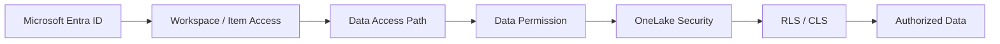
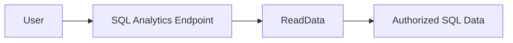
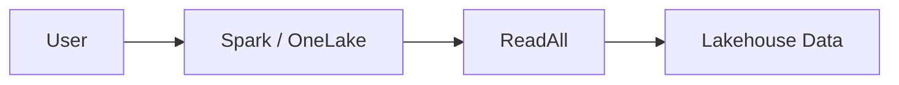
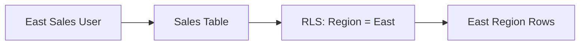
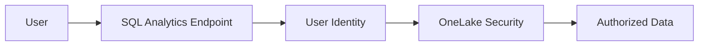
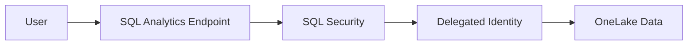
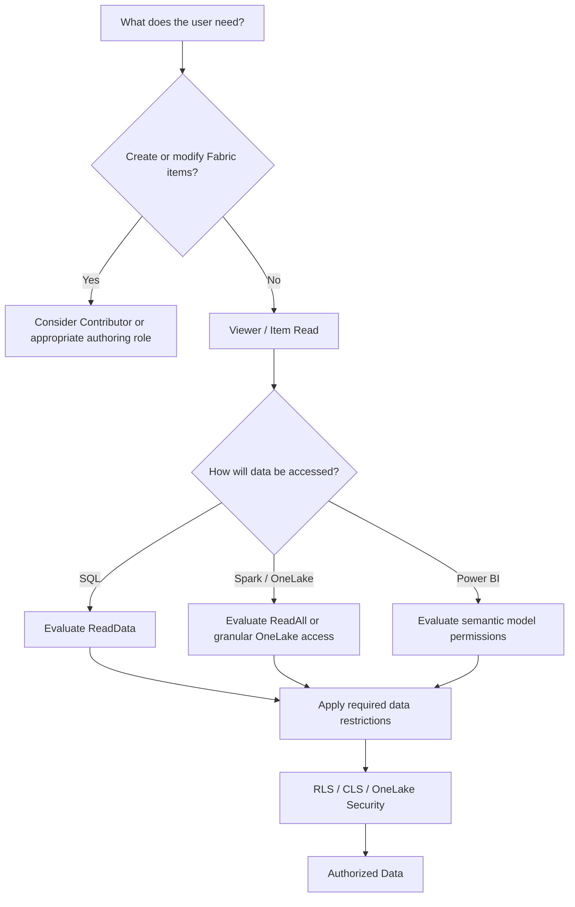

# Microsoft Fabric OneLake & Lakehouse Security

> Practical security reference for controlling access to Microsoft Fabric Lakehouse data through OneLake, Spark, SQL analytics endpoints, and downstream analytics experiences.

Microsoft Fabric security should be designed in layers.

A user having access to a workspace or Lakehouse item does **not automatically mean the user should have unrestricted access to all underlying data**.

---

## Security Model



The main security questions are:

1. **Who is the user?**
2. **Which workspace or item can they access?**
3. **How are they accessing the data?**
4. **What data permission do they have?**
5. **Which tables, folders, rows, or columns should they see?**

---

# Permission Guide

| Security Control | Applies To | Purpose | Example |
|---|---|---|---|
| Workspace Role | Workspace | Controls workspace capabilities | Admin, Member, Contributor, Viewer |
| Item Read | Fabric Item | Allows access to a specific item | Open a Lakehouse |
| ReadData | SQL / TDS | Allows supported SQL data access | Query through SQL analytics endpoint |
| ReadAll | OneLake / Spark | Broad underlying OneLake data access | Access Lakehouse data from Spark |
| OneLake Security Role | OneLake Data | Grants granular access to selected data | Sales tables only |
| RLS | Rows | Restricts records returned | East Region only |
| CLS | Columns | Restricts sensitive columns | Hide Salary |
| Build | Semantic Model | Allows creation of downstream BI content | Build Power BI report |

---

# Read vs ReadData vs ReadAll

These permissions are easy to confuse.

## Read

**Read** provides access to the Fabric item.

For example:

```text
User
 ↓
Lakehouse
 ↓
Item Read
```

Read answers:

> Can the user access this Fabric item?

It should not be interpreted as unrestricted access to every underlying data path.

---

## ReadData

**ReadData** is associated with accessing data through supported SQL/T-SQL interfaces.



Typical use case:

> An analyst needs to query Lakehouse or Warehouse data using T-SQL but does not require broad Spark/OneLake access.

---

## ReadAll

**ReadAll** provides broad access to underlying OneLake data through supported OneLake access paths.

Examples include:

- Spark
- Notebooks
- OneLake APIs
- Lakehouse explorer



Admin, Member, and Contributor roles can receive broader underlying data access than Viewer.

A Viewer does not receive ReadAll simply from the Viewer workspace role.

---

# ReadData vs ReadAll

| Requirement | ReadData | ReadAll |
|---|:---:|:---:|
| Open Fabric item | — | — |
| Query supported data through SQL/TDS | ✅ | — |
| Access underlying OneLake data broadly | — | ✅ |
| Spark / Notebook data access | — | ✅ |
| OneLake API access | — | ✅ |
| SQL-only analyst | ✅ | Usually not required |
| Broad Lakehouse engineering access | May apply | ✅ |

> Grant ReadAll only when broad underlying OneLake access is actually required.

---

# OneLake Security

OneLake security provides **data-level authorization** over data stored in OneLake.

Instead of granting broad access to an entire Lakehouse, security roles can be designed around the data users actually require.

Example:

```text
Lakehouse
│
├── Sales
│   ├── Customers        ✅ Permitted
│   ├── Orders           ✅ Permitted
│   └── Revenue          ✅ Permitted
│
├── Finance
│   ├── Payroll          ❌ Not Permitted
│   └── Budget           ❌ Not Permitted
│
└── HR
    ├── Employees        ❌ Not Permitted
    └── Compensation     ❌ Not Permitted
```

This allows a Sales group to work with Sales data without receiving unnecessary Finance or HR access.

---

# OneLake Security Roles

A OneLake security role can define:

```text
Role
  ↓
Permission
  ↓
Data Scope
  ↓
Members
```

For example:

```text
Role: Sales-Readers

Permission:
Read

Data Scope:
Sales tables

Members:
Sales-Entra-Group
```

The role determines **what access is granted, which data it applies to, and who receives that access**.

---

## Example Security Roles

| Security Role | Permission | Data Scope | Members | Result |
|---|---|---|---|---|
| Sales Readers | Read | Sales tables | Sales group | Sales data only |
| Finance Readers | Read | Finance tables | Finance group | Finance data only |
| HR Readers | Read | HR tables | HR group | HR data only |
| Data Engineering | ReadWrite | Engineering data scope | Engineering group | Read/write engineering access |
| Executive Readers | Read | Curated executive data | Executive group | Curated business data |

---

# Read and ReadWrite

OneLake security roles can provide different levels of access depending on the supported item and scenario.

## Read

Use when users only need to consume data.

```text
User
 ↓
OneLake Role
 ↓
READ
 ↓
Authorized Data
```

---

## ReadWrite

Use when the workload requires modification of supported OneLake data.

Depending on the supported scenario, ReadWrite can permit operations such as:

- Create
- Modify
- Delete
- Rename
- Upload
- Manage supported folders/tables
- Manage supported shortcuts

```text
Data Engineer
      ↓
OneLake Role
      ↓
ReadWrite
      ↓
Authorized Data Scope
```

ReadWrite should be reserved for users and workloads that genuinely need modification capabilities.

---

# Row-Level Security

Row-Level Security (**RLS**) restricts which rows a user can access.

Suppose the Sales table contains:

| Region | Customer | Revenue |
|---|---|---:|
| East | Customer A | $120,000 |
| West | Customer B | $95,000 |
| East | Customer C | $70,000 |
| West | Customer D | $110,000 |

An East Region user could be restricted to:

| Region | Customer | Revenue |
|---|---|---:|
| East | Customer A | $120,000 |
| East | Customer C | $70,000 |

Architecture:



RLS answers:

> Which records can this user see?

---

# Column-Level Security

Column-Level Security (**CLS**) restricts access to selected columns.

Example:

| Column | General Employee | HR |
|---|:---:|:---:|
| EmployeeName | ✅ | ✅ |
| Department | ✅ | ✅ |
| JobTitle | ✅ | ✅ |
| Salary | ❌ | ✅ |
| SensitiveIdentifier | ❌ | ✅ |

Architecture:

```text
Employee Table
      │
      ├── Name             → Permitted
      ├── Department       → Permitted
      ├── Job Title        → Permitted
      ├── Salary           → Restricted
      └── Sensitive ID     → Restricted
```

CLS answers:

> Which attributes can this user see?

---

# RLS vs CLS

| Security Type | Controls | Example |
|---|---|---|
| RLS | Rows | User sees East Region only |
| CLS | Columns | User cannot see Salary |
| RLS + CLS | Rows and columns | User sees East Region but not sensitive financial columns |

They can be combined when supported by the security design.

---

# OneLake Security + SQL Analytics Endpoint

A Lakehouse SQL analytics endpoint provides a T-SQL query experience over Lakehouse data.

One important architecture decision is the **Data Access Mode** used by the SQL analytics endpoint.

Two concepts to understand are:

```text
User Identity
vs.
Delegated Identity
```

---

# User Identity Access Mode

With **User Identity** access mode, the signed-in user's identity is used when accessing the underlying OneLake table data.



This allows OneLake security to govern table access based on the actual user.

A simplified security flow is:

```text
User
 ↓
Item Access
 ↓
SQL Analytics Endpoint
 ↓
User Identity
 ↓
OneLake Security
 ↓
Authorized Tables / Rows / Columns
```

---

# Delegated Identity Access Mode

With delegated identity, the SQL analytics endpoint accesses the underlying data using the delegated identity model rather than evaluating table access directly as the signed-in user's OneLake identity.

Conceptually:



The security design therefore differs from User Identity mode.

---

# User Identity vs Delegated Identity

| Area | User Identity | Delegated Identity |
|---|---|---|
| Table data authorization | OneLake security | SQL permissions govern user access |
| Signed-in identity evaluated against OneLake | Yes | No, delegated access model |
| Centralize table security in OneLake | Strong fit | SQL-centric security model |
| SQL views/functions/procedures | SQL security | SQL security |

> When using **User Identity access mode**, design table-level authorization primarily through OneLake security while continuing to use SQL security for SQL-specific objects such as views, functions, and stored procedures.

---

# SQL Objects vs OneLake Tables

An important distinction is:

| Object | Primary Security Layer |
|---|---|
| Lakehouse table | OneLake security when using User Identity mode |
| Table row restrictions | OneLake security |
| Table column restrictions | OneLake security |
| SQL View | SQL security |
| SQL Stored Procedure | SQL security |
| SQL Function | SQL security |

This prevents mixing the responsibilities of OneLake security and SQL object security.

---

# Common Access Scenarios

## Scenario 1 — Business User Needs SQL Read Access

Requirement:

> User needs to query approved Lakehouse data using T-SQL.

Possible design:

```text
Viewer / Item Read
       +
Required SQL Access
       +
ReadData
       +
Applicable Data Security
```

Avoid giving Contributor merely because the user needs to query data.

---

## Scenario 2 — User Needs Only Selected Lakehouse Data

Requirement:

> Sales users should access Sales data but not HR or Finance.

Preferred approach:

```text
Viewer / Item Read
        ↓
Granular OneLake Security
        ↓
Sales Data
```

Instead of:

```text
Viewer
   +
Broad ReadAll
   ↓
Entire Lakehouse
```

Grant only the required data scope.

---

## Scenario 3 — Regional Sales Access

Requirement:

> Sales users can access the Sales table, but each region should see only its own records.

```text
Sales Group
     ↓
OneLake Security Role
     ↓
Sales Table
     ↓
RLS
     ↓
User's Region
```

---

## Scenario 4 — Protect Sensitive Columns

Requirement:

> Managers can view employee information but should not see compensation data.

```text
Manager
   ↓
Employee Table
   ↓
CLS
   ↓
Salary Restricted
```

---

## Scenario 5 — Data Engineer Needs Spark

Requirement:

> Data engineer needs broad access to Lakehouse data using notebooks and Spark.

Possible design:

```text
Contributor
     +
ReadAll
     ↓
Spark / Notebook
     ↓
Lakehouse
```

This is different from a business analyst who only needs SQL or report consumption.

---

## Scenario 6 — Power BI Report Author

Requirement:

> User needs to build Power BI reports from an approved semantic model.

```text
Semantic Model
      ↓
Build Permission
      ↓
Report Author
```

**Build** is a semantic-model permission. It should not be confused with ReadData or ReadAll.

---

# Least-Privilege Decision Guide



---

# Security Design Examples

| User / Persona | Workspace / Item Access | Data Access | Additional Security |
|---|---|---|---|
| Report Consumer | Viewer / Report Read | Semantic model | RLS if required |
| Power BI Author | Appropriate item access | Build | Semantic model security |
| SQL Analyst | Viewer / Item Read | ReadData | OneLake/SQL security as applicable |
| Data Scientist | Appropriate workspace access | ReadAll where required | Restricted data scope where possible |
| Data Engineer | Contributor | ReadAll / required write access | Least-privilege data scope |
| Regional User | Viewer / Item Read | Required read permission | RLS |
| Sensitive Data Consumer | Viewer / Item Read | Required read permission | CLS / RLS |

---

# What Not to Do

Avoid designs such as:

```text
User needs data
     ↓
Give Contributor
```

or:

```text
User needs one table
     ↓
Give broad ReadAll
```

or:

```text
User needs Power BI
     ↓
Give access to entire Lakehouse
```

Instead:

```text
Business Requirement
       ↓
Lowest Workspace / Item Access
       ↓
Required Access Path
       ↓
Minimum Data Permission
       ↓
Granular Security
       ↓
Authorized Data
```

---

# Architecture Principle

The security model should answer four separate questions:

### 1. Workspace Security
**What can the user do in the workspace?**

### 2. Item Security
**Which Fabric item can the user access?**

### 3. Data Security
**Which underlying data can the user access?**

### 4. Granular Security
**Which tables, folders, rows, and columns can the user see?**

These controls should be designed independently and then combined according to the business requirement.

---

# Key Takeaway

```text
Microsoft Entra Identity
        ↓
Workspace / Item Access
        ↓
Choose Access Path
        ↓
ReadData / ReadAll / Granular Access
        ↓
OneLake Security
        ↓
RLS / CLS
        ↓
Authorized Data
```

The goal is not to give users the broadest role that makes the solution work.

The goal is to provide:

> **The minimum workspace, item, and data permissions required for the user to perform their job.**

---

## Related Documentation

- [01 — Workspace Roles & Permissions](01-Workspace-Roles-and-Permissions.md)
- [Microsoft Fabric OneLake security](https://learn.microsoft.com/en-us/fabric/onelake/security/get-started-security)
- [Create and manage OneLake security roles](https://learn.microsoft.com/en-us/fabric/onelake/security/create-manage-roles)
- [OneLake data access control model](https://learn.microsoft.com/en-us/fabric/onelake/security/data-access-control-model)
- [Row-level security in OneLake](https://learn.microsoft.com/en-us/fabric/onelake/security/row-level-security)
- [OneLake security and SQL analytics endpoints](https://learn.microsoft.com/en-us/fabric/onelake/security/sql-analytics-endpoint-onelake-security)

---

> **Note:** Microsoft Fabric security capabilities continue to evolve. Preview and newly released functionality should be validated against current Microsoft documentation before being adopted as a production security standard.
