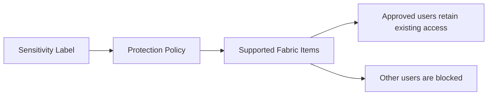
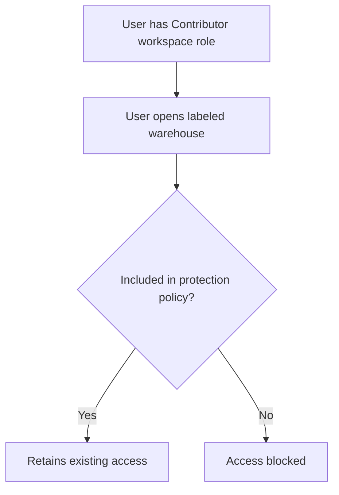

# Microsoft Fabric Protection Policies

## Overview

Microsoft Purview protection policies for Fabric provide centralized, sensitivity-label-based access enforcement across supported Microsoft Fabric items.

These policies help organizations apply consistent protection across the Fabric footprint instead of manually configuring the same restriction in every workspace and item.

Protection policies are especially useful for sensitive data such as:

- Payroll information
- Financial information
- Personally identifiable information
- Healthcare information
- Legal and compliance information
- Confidential business information

---

## Sensitivity Label vs. Protection Policy

A sensitivity label and a protection policy have related but different responsibilities.

| Capability | Purpose |
|---|---|
| Sensitivity label | Classifies an item based on its sensitivity |
| Protection policy | Controls who can retain access to items carrying the label |
| DLP policy | Detects sensitive data and responds to policy violations |
| Workspace role | Provides general workspace-level permissions |
| Item permission | Provides access to a specific Fabric item |
| OneLake security | Controls access to data stored in OneLake |

The easiest way to remember the relationship is:

> **The sensitivity label identifies the sensitive item. The protection policy enforces access to the labeled item.**

---

## How Protection Policies Work

Each Fabric protection policy is associated with one Microsoft Purview sensitivity label.

The policy identifies the users and groups allowed to retain their existing permissions on items carrying that label.

Users and groups not included in the policy are blocked from accessing the labeled items.

The protection policy does not automatically grant new permissions.

An approved user must already have access through a workspace role, item permission, or another Fabric permission mechanism. The policy only allows that user to retain the access already assigned.

---

## Fabric-Wide Enforcement

Protection policies are designed to apply consistently across supported Fabric items in all workspaces.

This means administrators do not have to configure the same protection separately in every workspace.

The enforcement process is:

1. An administrator creates a sensitivity label in Microsoft Purview.
2. The label is applied to a supported Fabric item.
3. A protection policy is associated with the sensitivity label.
4. The policy identifies the users and groups allowed to retain access.
5. Fabric evaluates labeled items across its supported footprint.
6. Users not included in the policy are blocked.

> **Fabric-wide enforcement means centralized enforcement across supported Fabric items. It does not mean every Fabric and Power BI item type is currently supported.**

---

## Supported Fabric Items

Protection policies support native Fabric items, including:

- Lakehouses
- Warehouses
- SQL databases
- KQL databases
- Eventhouses
- Notebooks
- Pipelines
- Other native Fabric items
- Power BI semantic models

Power BI reports and dashboards are not currently supported by Fabric protection policies.

---

## Relationship to Workspace Roles

Workspace roles and protection policies work together, but they serve different purposes.

Workspace roles grant broad capabilities within a workspace. Protection policies can further restrict access to individual items carrying a protected sensitivity label.

### Example

A user has the Contributor role in a Finance workspace.

Normally, the Contributor role allows the user to create, modify, and read supported items.

However, a warehouse in that workspace has the **Highly Confidential - Payroll** sensitivity label. A protection policy allows only members of the Payroll security group to retain access.

If the Contributor is not included in the approved group, the protection policy blocks access to the labeled warehouse.

Therefore:

> **Workspace access does not override a Fabric protection policy.**

---

## Requirements

Fabric protection policies require:

- Appropriate Microsoft 365 E3 or E5 licensing for Microsoft Purview sensitivity labels
- At least the Information Protection Administrator role to create the policy
- A sensitivity label configured in Microsoft Purview
- The label must be scoped to **Files and other data assets**
- The label must include the **Control access** protection setting
- The Fabric tenant setting **Allow users to apply sensitivity labels for content** must be enabled

Only appropriately configured sensitivity labels can be associated with Fabric protection policies.

---

## Creating a Protection Policy

The high-level configuration process is:

1. Open the Microsoft Purview portal.
2. Open the **Protection policies** page.
3. Select **New protection policy**.
4. Enter the policy name and description.
5. Select the sensitivity label associated with the policy.
6. Select Microsoft Fabric as the data source.
7. Add the users and groups allowed to retain access.
8. Decide whether to activate the policy immediately.
9. Review and submit the policy.

After creation, it can take up to 24 hours for the policy to begin detecting and protecting items associated with the sensitivity label.

---

## Service Principal Considerations

Service principals cannot be added directly to a protection policy through the Microsoft Purview portal.

If a service principal requires access to protected Fabric items:

1. Add the service principal to a Microsoft Entra security group.
2. Add that security group to the protection policy.
3. Confirm that the service principal already has the required Fabric permissions.
4. Test all dependent applications and automated processes.

If a required service principal is not included in an allowed security group, the protection policy can block it and cause failures in:

- Pipelines
- Applications
- Semantic-model access
- API integrations
- Automated processes
- Other service-principal-based connections

> **The impact on service principals must be evaluated before enabling a protection policy in production.**

---

## Limitations and Considerations

- A tenant can have up to 50 protection policies.
- A policy can contain up to 100 users and groups.
- Each policy is associated with one sensitivity label.
- Guest and external users are not currently supported.
- Policy enforcement can take up to 24 hours.
- Power BI reports and dashboards are not currently supported.
- Deployment pipelines and Git integration use workspace permissions and do not enforce protection-policy item permissions during deployment operations.
- The user who last applied the sensitivity label is treated as the label issuer and is not blocked by the associated protection policy.
- Automatically applied or inherited labels may have special issuer behavior.
- Service principals must be included through Microsoft Entra security groups.

---

## Recommended Implementation Approach

Before enabling a protection policy in production:

1. Identify the business data requiring protection.
2. Confirm the sensitivity-label design with the security and compliance teams.
3. Identify all users, groups, service principals, and automated processes requiring access.
4. Use Microsoft Entra security groups instead of adding many individual users.
5. Test the policy with a limited group of nonproduction Fabric items.
6. Validate interactive user access.
7. Validate pipeline, API, semantic-model, and application access.
8. Review the effect on deployment pipelines and Git-integrated workspaces.
9. Document the policy owner and approval process.
10. Monitor restricted access through the OneLake catalog and Fabric administration experiences.

---

## Example: Payroll Data Protection

An organization has a Finance workspace containing a warehouse with employee payroll information.

### Configuration

- Sensitivity label: **Highly Confidential - Payroll**
- Protected item: Finance Payroll Warehouse
- Approved group: Payroll Data Users
- Approved administrators: Selected Fabric and security administrators
- Approved automation: Payroll service principal added through an Entra security group

### Expected Result

- Approved users retain their existing permissions.
- The payroll service principal continues to operate.
- Other workspace users are blocked from the labeled warehouse.
- The source item remains in the Finance workspace.
- Enforcement is controlled centrally through Microsoft Purview.

---

## Key Takeaways

- Fabric protection policies provide centralized access enforcement across supported Fabric items.
- Policies use Microsoft Purview sensitivity labels to identify protected items.
- Approved identities retain their existing access.
- Protection policies do not grant new permissions.
- Users not included in the policy are blocked from labeled items.
- Protection policies can restrict access normally provided through a workspace role.
- Service principals must be included through Microsoft Entra security groups.
- Policies should be tested carefully before production implementation.
- Protection policies complement workspace roles, item permissions, OneLake security, and DLP policies.

The main concept is:

> **Sensitivity labels classify Fabric items, while protection policies enforce who is permitted to retain access across the supported Fabric footprint.**

---

## References

- [Protection policies in Microsoft Fabric](https://learn.microsoft.com/fabric/governance/protection-policies-overview)
- [Create and manage protection policies for Fabric](https://learn.microsoft.com/fabric/governance/protection-policies-create)
- [Information protection in Microsoft Fabric](https://learn.microsoft.com/fabric/governance/information-protection)
- [Microsoft Fabric permission model](https://learn.microsoft.com/fabric/security/permission-model)
- [Workspace roles in Microsoft Fabric](https://learn.microsoft.com/fabric/fundamentals/roles-workspaces)

