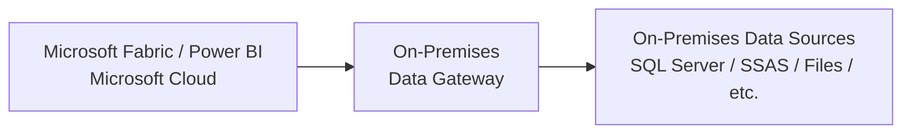
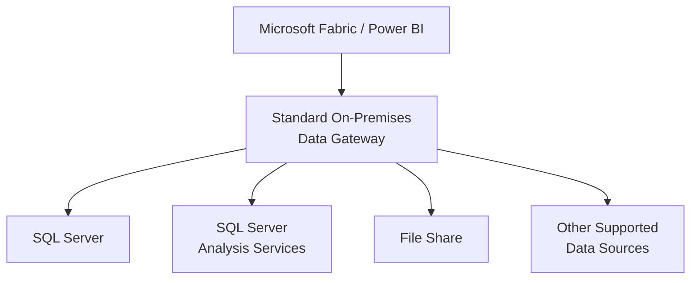
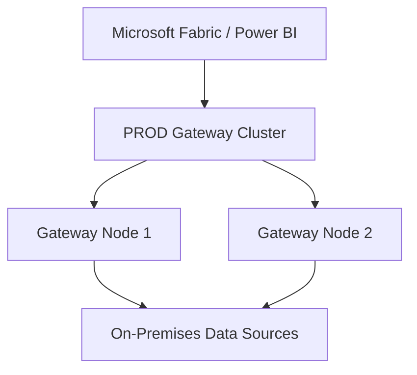
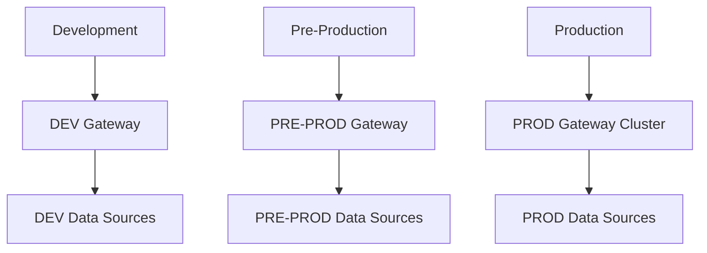
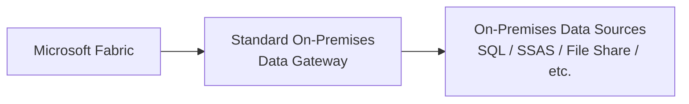
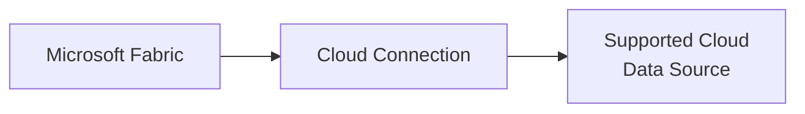
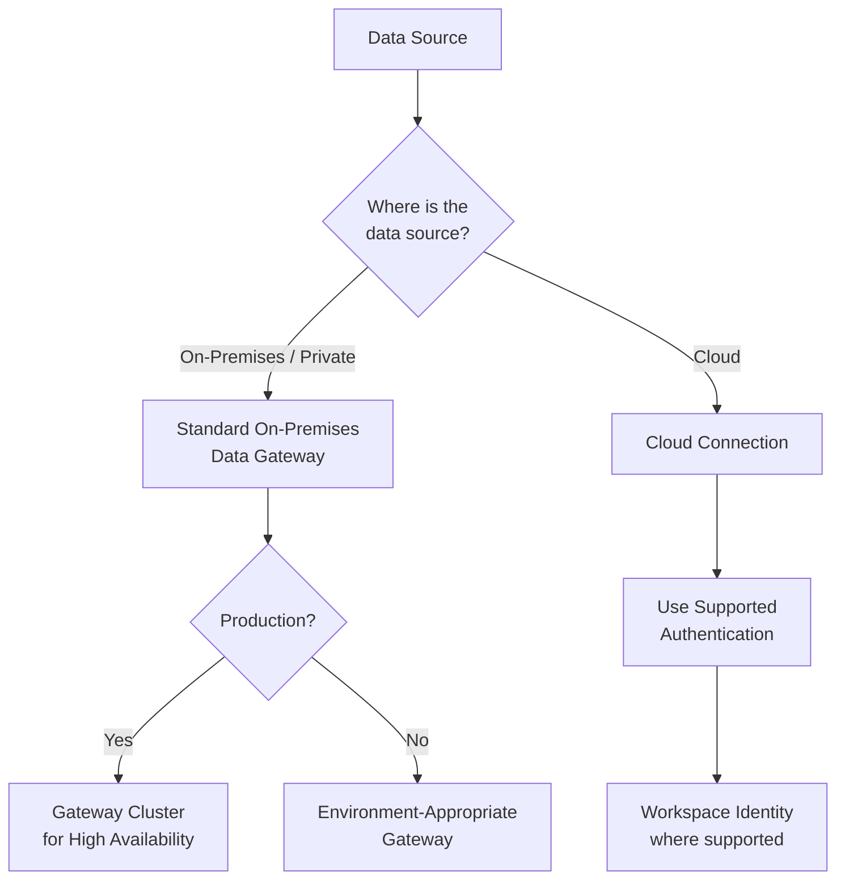

# On-Premises Data Gateway

## 1. Gateway Overview

### What is an On-Premises Data Gateway?

The Microsoft **on-premises data gateway** acts as a bridge between Microsoft cloud services and data sources located inside an organization's private network.

For example, an organization may have SQL Server databases running on-premises while Microsoft Fabric or Power BI runs in the Microsoft cloud.

The gateway allows supported Microsoft cloud services to securely communicate with those on-premises data sources without exposing the database directly to the internet.

### How It Works



### Key Point

The gateway is **not the data source** and does not store business data.

It provides the communication path between supported Microsoft cloud services and data sources that remain inside the organization's private network.

---

## 2. Types of Gateway

There are two main modes of the on-premises data gateway:

| Gateway Type | Best Used For | Shared | High Availability |
|---|---|---|---|
| **Standard Mode** | Team and enterprise environments | Yes | Yes |
| **Personal Mode** | Individual Power BI users | No | No |

### Personal Mode

Personal mode is mainly designed for an individual Power BI user who needs to connect to an on-premises data source.

It can be useful for:

- Individual Power BI development
- Personal or self-service reporting
- Testing and learning

Personal mode is associated with an individual user and is not intended to provide shared enterprise gateway infrastructure.

For centrally managed enterprise environments, I prefer the **standard on-premises data gateway**.

### Standard Mode

The standard on-premises data gateway is designed for shared and enterprise environments.

It allows gateway infrastructure to be centrally managed and can support multiple users, workloads, and configured data source connections.

Typical use cases include:

- Microsoft Fabric
- Shared Power BI environments
- Multiple users and teams
- Multiple data source connections
- Production workloads
- High-availability gateway clusters

---

## 3. Standard Gateway Architecture

A standard gateway can provide connectivity to multiple supported on-premises data sources.



Instead of individual users maintaining separate personal gateways, authorized users and workloads can use centrally managed gateway infrastructure.

### Benefits

- Centralized administration
- Shared gateway infrastructure
- Multiple data source connections
- Support for multiple users and workloads
- Better security and governance
- Easier maintenance
- Support for high availability

---

## 4. Gateway Cluster and High Availability

For production environments, I prefer to use a **gateway cluster** instead of relying on a single gateway server.

A gateway cluster contains multiple gateway nodes that work together to provide high availability.



If one gateway node becomes unavailable because of maintenance, patching, restart, or server failure, another available node in the cluster can continue handling gateway requests.

### Gateway Node Placement

Gateway nodes should be installed on **separate servers or virtual machines** so that the failure of one server does not make the entire gateway unavailable.

Where possible, I would also avoid placing both production gateway nodes on infrastructure that has the same failure point.

Both gateway nodes must have reliable network connectivity to the data sources they support.

### High Availability vs. Disaster Recovery

A gateway cluster primarily provides **high availability** for gateway node failures.

Disaster recovery is a broader architecture consideration.

If protection from a datacenter or regional outage is required, I would design that separately based on the organization's business continuity and recovery requirements.

---

## 5. Environment Separation

For enterprise environments, I prefer to separate gateway infrastructure by environment.

For example:

- DEV
- PRE-PROD / TEST
- PROD



Separating the environments provides better isolation between development, testing, and production workloads.

For example, development testing or a large refresh should not compete for the same gateway resources being used by production.

It also allows production gateway infrastructure to have its own security, maintenance, monitoring, and high-availability requirements.

---

## 6. Gateway Connections and Naming Standards

A standard gateway can support connections to different types of on-premises data sources.

Examples include:

- SQL Server
- SQL Server Analysis Services
- Oracle
- File shares
- Other supported on-premises sources

I prefer to use a consistent naming convention for gateway connections so administrators can easily identify the environment, source type, and purpose.

### Naming Convention

```text
<Environment>-<SourceType>-<ApplicationOrPurpose>
```

Examples:

```text
DEV-SQL-Finance
DEV-SSAS-Sales
DEV-FILESHARE-Reporting

PREPROD-SQL-Finance
PREPROD-SSAS-Sales
PREPROD-FILESHARE-Reporting

PROD-SQL-Finance
PROD-SSAS-Sales
PROD-FILESHARE-Reporting
```

The exact naming convention can vary by organization.

The important point is to use a **consistent standard** rather than allowing connections to be created with unclear or inconsistent names.

---

## 7. On-Premises vs. Cloud Connections

Not every Microsoft Fabric connection requires an on-premises data gateway.

The connection method should depend on **where the data source is located and how it can be securely accessed**.

### On-Premises Data Sources

For supported data sources located inside the organization's private network, the standard on-premises data gateway can provide the connectivity path.



### Cloud Data Sources

For supported cloud data sources, a **cloud connection** can be used when an on-premises gateway is not required.



This avoids introducing gateway infrastructure when Fabric can securely connect to the cloud data source using a supported connection method.

---

## 8. Authentication

Authentication determines **which identity Fabric uses to access a data source**.

For enterprise workloads, I prefer to avoid using an individual employee account for production connections. The authentication method should be selected based on the data source, connector, and authentication options supported by that workload.

### Authentication Options

| Authentication | Best Fit | Example |
|---|---|---|
| **Service Account** | Traditional on-premises resources | SQL Server, SSAS, File Share |
| **Service Principal** | Application/workload authentication using Microsoft Entra ID | Supported Azure and cloud resources |
| **Workspace Identity** | Fabric-managed identity | Supported Fabric-to-Azure/cloud scenarios |
| **User Account** | Development or interactive access | Individual development/testing |

---

### Service Account

For traditional on-premises data sources that require Windows authentication, a dedicated **service account** can be used for the gateway connection.

For example:


The **gateway provides the connectivity**, while the configured service account provides the credentials used to authenticate to the data source.

The service account should follow least-privilege principles and only receive the permissions required by the connection.

A dedicated service account is preferable to using an individual employee account for production workloads because the connection is not tied to an individual user's account lifecycle.

> **Important:** The account running the Windows gateway service and the credentials configured for a gateway data source connection are separate concepts.

---

### Service Principal

A **service principal** is a non-human Microsoft Entra identity that can be used for application or workload authentication where supported.

Instead of a person's account:

```text
Individual User
     ❌
Production Workload
```

the workload can use:

```text
Production Workload
        ↓
Service Principal
        ↓
Supported Resource
```

This is useful for automated workloads because authentication does not depend on an individual user's account.

Service principals can be useful for:

- Automated workloads
- Pipelines
- Application-to-application authentication
- CI/CD
- Supported cloud data connections

For SQL Server 2022 and later, Microsoft Entra authentication can be configured in supported environments. However, the authentication method must still be supported by the specific Fabric connector and connection scenario.

---

### Workspace Identity

A **workspace identity** is an identity associated with a Microsoft Fabric workspace.

Where supported, Fabric workloads can use the workspace identity to authenticate to other resources.


This provides an important advantage for enterprise architecture:

**the workload is associated with the workspace rather than an individual user's identity.**

Fabric manages the identity credentials, reducing the need to maintain passwords or service principal secrets.

Workspace identity should be used only for workloads and connections that support it.

It should not be confused with the on-premises data gateway:

| Gateway | Workspace Identity |
|---|---|
| Provides network connectivity | Provides authentication identity |
| Primarily connects to private/on-premises sources | Used by supported Fabric workloads |
| Runs on gateway infrastructure | Associated with the Fabric workspace |

---

### My Authentication Approach

For production workloads, my preference is to use a **non-personal identity whenever the technology supports it**.

The choice depends on the connection:

**On-Premises + Windows Authentication**  
→ Dedicated service account

**Supported Entra-based application authentication**  
→ Service principal

**Supported Fabric workspace authentication**  
→ Workspace identity

**Development / Interactive Access**  
→ User identity where appropriate

The goal is to use **least privilege**, avoid unnecessary dependency on individual user accounts, and select the authentication method supported by the specific workload and data source.
---

## 9. Architecture Summary

My general approach is:



The main principle is that I don't automatically use a gateway for every connection.

I first consider:

**Data Source Location → Connectivity → Authentication → Environment → Availability**

For on-premises data sources, the standard gateway provides the connectivity path.

For cloud data sources, I prefer cloud-native connections when supported.

For production gateway workloads, I prefer a gateway cluster rather than relying on a single gateway server.

For enterprise environments, I also prefer separating DEV, PRE-PROD, and PROD gateway infrastructure to provide better workload and security isolation.

