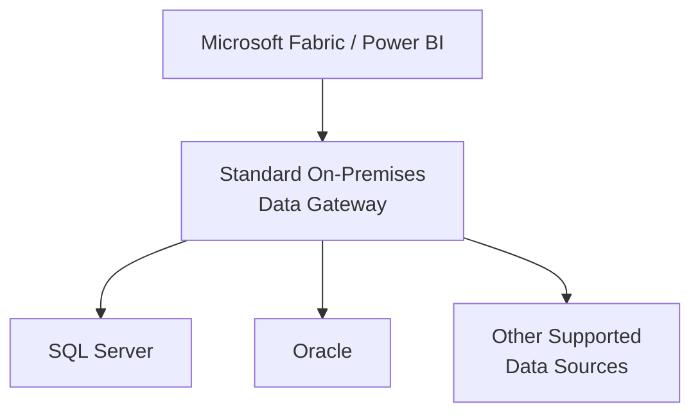
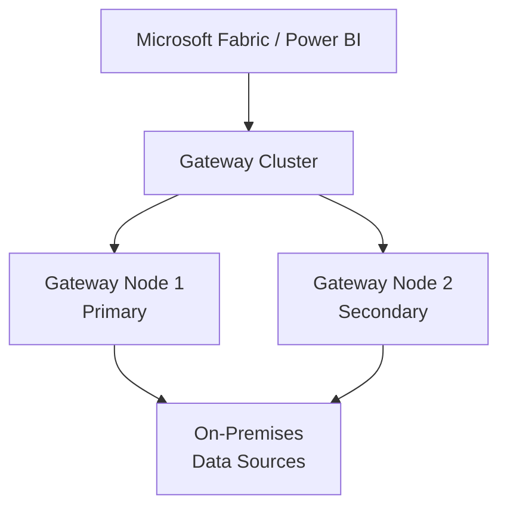
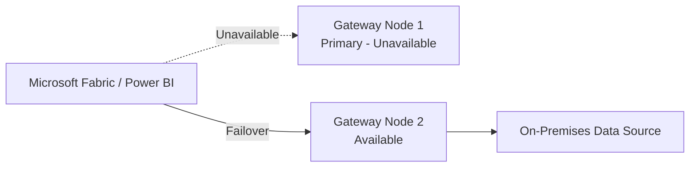

# On-Premises Data Gateway

## 1. Gateway Overview

### What is an On-Premises Data Gateway?

The Microsoft on-premises data gateway acts as a bridge between Microsoft cloud services and data sources located inside an organization's private network.

For example, an organization may have SQL Server databases running on-premises while Microsoft Fabric or Power BI is running in the Microsoft cloud.

The gateway allows supported Microsoft cloud services to securely communicate with those on-premises data sources without exposing the database directly to the internet.

### How It Works


---

## 2. Types of Gateway

There are two main modes of the on-premises data gateway:

| Gateway Type | Best Used For | Shared | High Availability |
|---|---|---|---|
| **Standard Mode** | Team and enterprise environments | Yes | Yes |
| **Personal Mode** | Individual Power BI users | No | No |

### Personal Mode

Personal mode is mainly intended for an individual Power BI user who needs to connect to on-premises data.

It can be useful for:

- Individual Power BI development
- Personal reporting
- Testing and learning
- Scenarios where centralized gateway management is not required

Personal mode cannot be shared with other users and does not support gateway clustering or high availability.

For a shared enterprise environment, I would use the standard on-premises data gateway instead of personal mode.

### Standard Mode

The standard on-premises data gateway is designed for shared and enterprise environments.

A standard gateway can support multiple users and multiple configured data source connections.

Instead of each user maintaining a personal gateway, the organization can centrally manage the gateway infrastructure and allow authorized users and workloads to use it.

Typical scenarios include:

- Microsoft Fabric
- Shared Power BI environments
- Multiple data source connections
- Multiple users and teams
- Centralized gateway administration
- Production workloads
- High-availability gateway clusters

---

## 3. Standard Gateway Architecture

A shared gateway can provide access to multiple on-premises data sources.



### Benefits of Standard Mode

- Centralized administration
- Shared gateway infrastructure
- Multiple data source connections
- Support for multiple users and workloads
- Better security and governance
- Easier maintenance
- Support for high availability

---

## 4. Gateway Cluster and High Availability

For a production environment, relying on a single gateway server introduces a single point of failure.

A better design is to configure multiple standard gateway installations as a **gateway cluster**.

For example:



Each gateway node is installed on a separate machine and registered as a member of the same gateway cluster.

### Failover

Under the normal cluster behavior, requests use the primary gateway member.

If the primary gateway becomes unavailable, the gateway service routes requests to another available member of the cluster.



This removes the individual gateway server as a single point of failure.

### Example

If Gateway Node 1 is unavailable because of:

- Server maintenance
- Operating system patching
- Server restart
- Gateway service failure
- Hardware or VM failure

Gateway Node 2 can continue handling gateway requests.

This allows planned maintenance to be performed with less impact to workloads that depend on the gateway.

---

## 5. Gateway Server Placement

Gateway nodes should be installed on separate machines.

For production environments, I would also avoid placing both gateway nodes on infrastructure that shares the same failure point.

For example, where infrastructure design allows:

```text
Gateway Cluster
│
├── Gateway Node 1
│   └── Location / Failure Domain A
│
└── Gateway Node 2
    └── Location / Failure Domain B
```

The goal is to avoid a situation where one infrastructure failure takes both gateway nodes offline.

Gateway servers should also have reliable network connectivity to the data sources they access. Network latency between the gateway and the data source should be considered when deciding where the gateway servers are located.

---

## 6. High Availability vs. Disaster Recovery

High availability and disaster recovery solve different problems.

### High Availability

A gateway cluster protects against the failure of an individual gateway server.

```text
Gateway Node 1 fails
        ↓
Gateway Node 2 continues processing requests
```

### Disaster Recovery

For environments where a regional outage is an important business risk, a separate disaster recovery design should also be considered.

This may include gateway infrastructure in another location or Azure region, depending on the organization's architecture and recovery requirements.

The objective is different:

**Gateway Cluster**
→ Protects against gateway node/server failure.

**Disaster Recovery Design**
→ Protects against a larger infrastructure or regional failure.

---

## 7. Gateway Design Principles

For an enterprise gateway environment, my design principles are:

1. Use the **standard on-premises data gateway** for shared workloads.
2. Avoid personal gateways for centrally managed production solutions.
3. Use a **gateway cluster** for production high availability.
4. Install gateway cluster members on **separate machines**.
5. Avoid placing all gateway nodes within the same infrastructure failure point when possible.
6. Keep gateway nodes reasonably close to the data sources to reduce unnecessary network latency.
7. Keep gateway members on the same supported gateway version.
8. Monitor gateway availability, resource utilization, and connectivity.
9. Document and protect the gateway recovery key.
10. Consider a separate disaster recovery architecture when regional resiliency is required.

---

## My Understanding

I think of the gateway as a secure bridge between Microsoft cloud services and data sources that remain inside an organization's private network.

For an enterprise environment, I prefer the standard on-premises data gateway because it can be centrally managed and shared across multiple users and data source connections.

For production, I would not want the gateway to depend on a single server. I would configure at least two gateway nodes as a cluster so another node can continue processing requests if one gateway server becomes unavailable.

I would also separate the gateway nodes across infrastructure failure domains where practical, while keeping network latency to the underlying data sources in mind.

For systems that require protection from a larger site or regional outage, I would treat disaster recovery as a separate architecture decision rather than assuming that a basic two-node gateway cluster provides regional disaster recovery.
